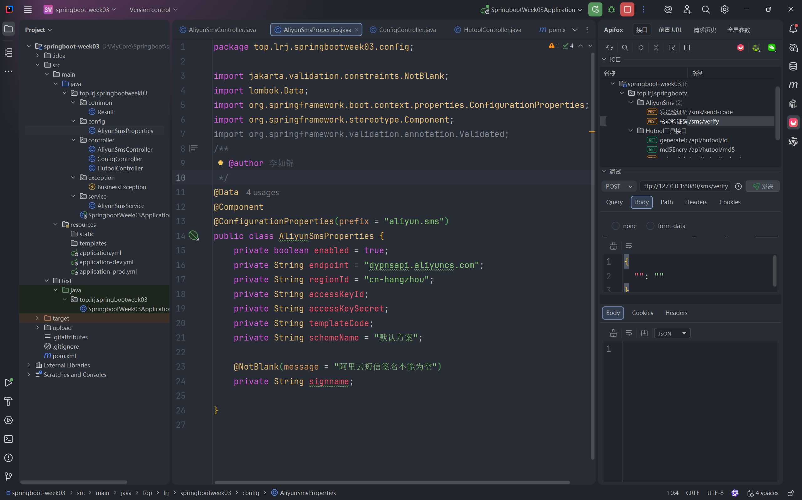
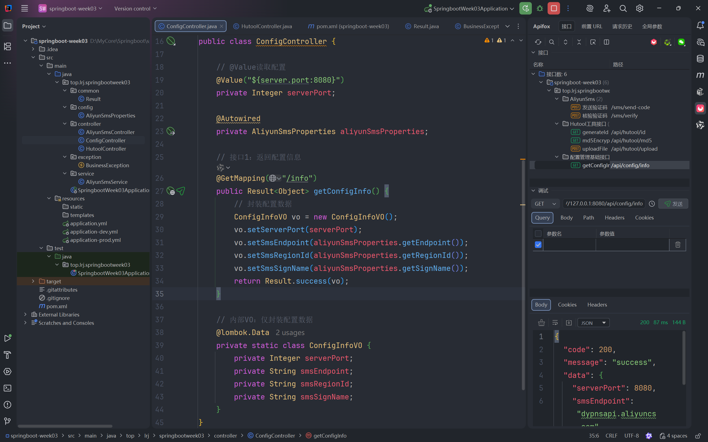
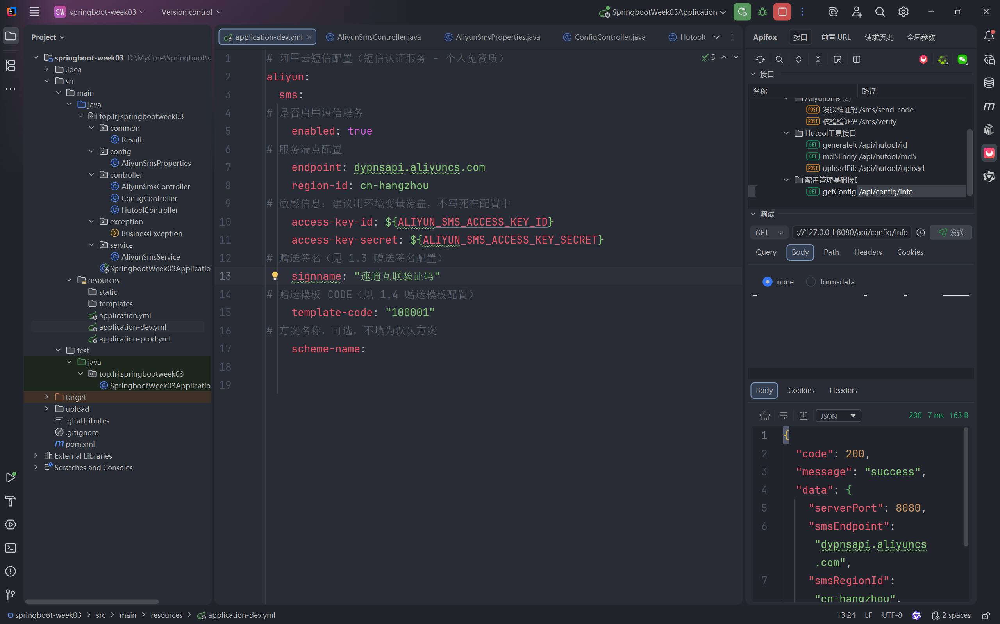
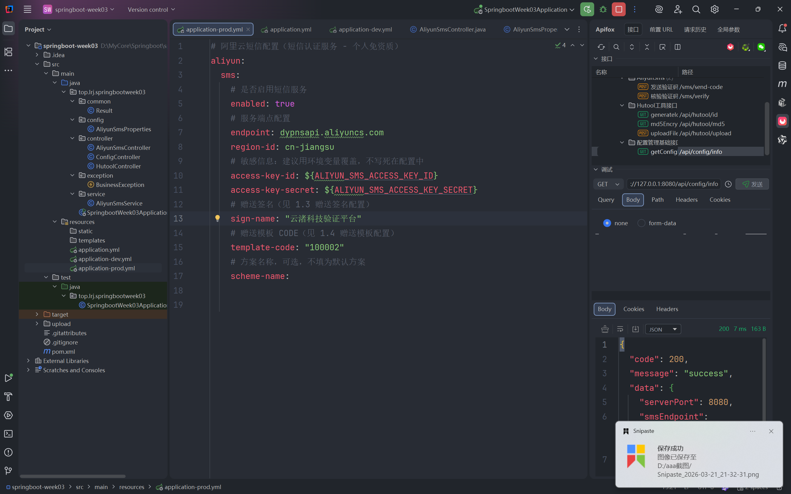
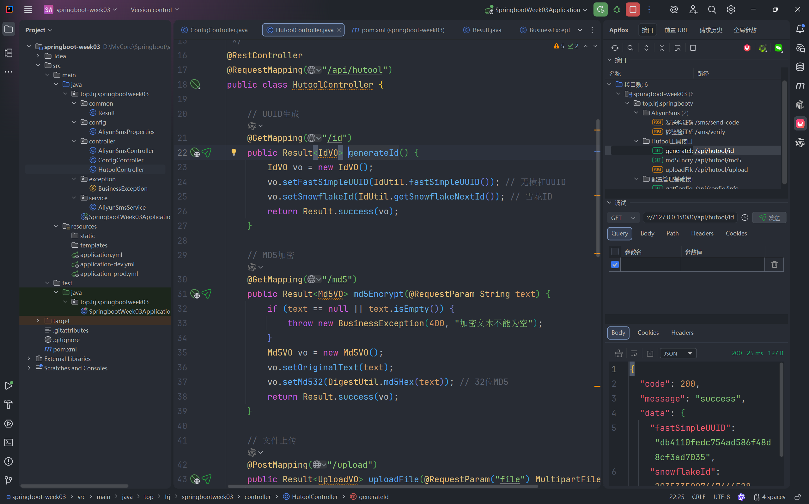
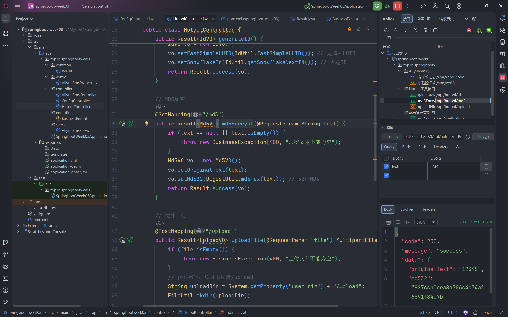
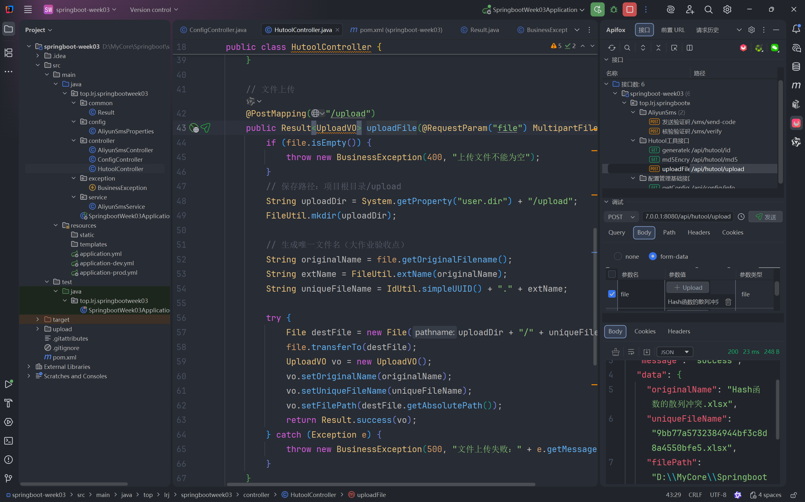
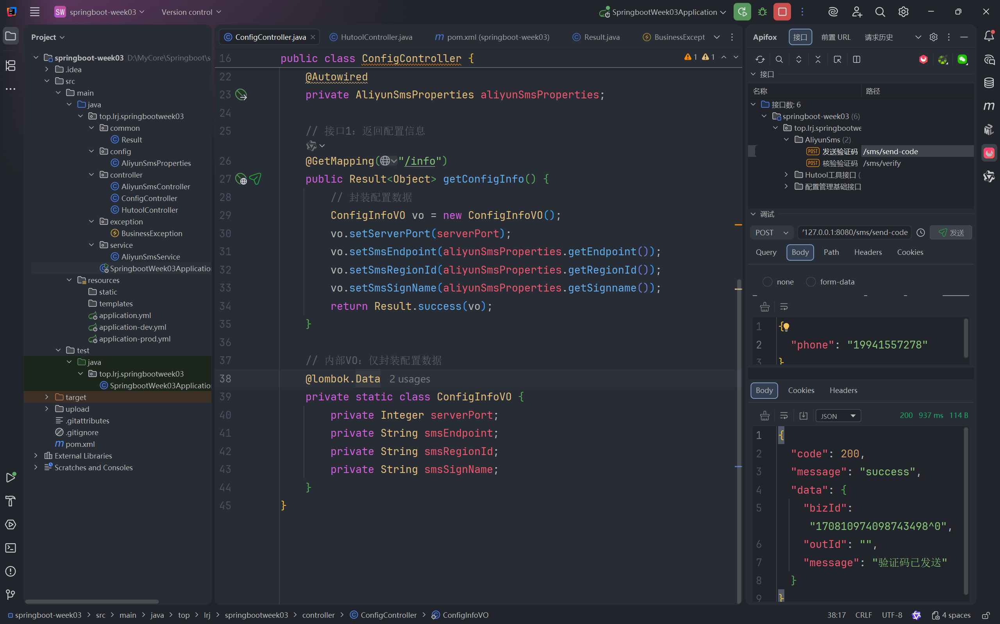
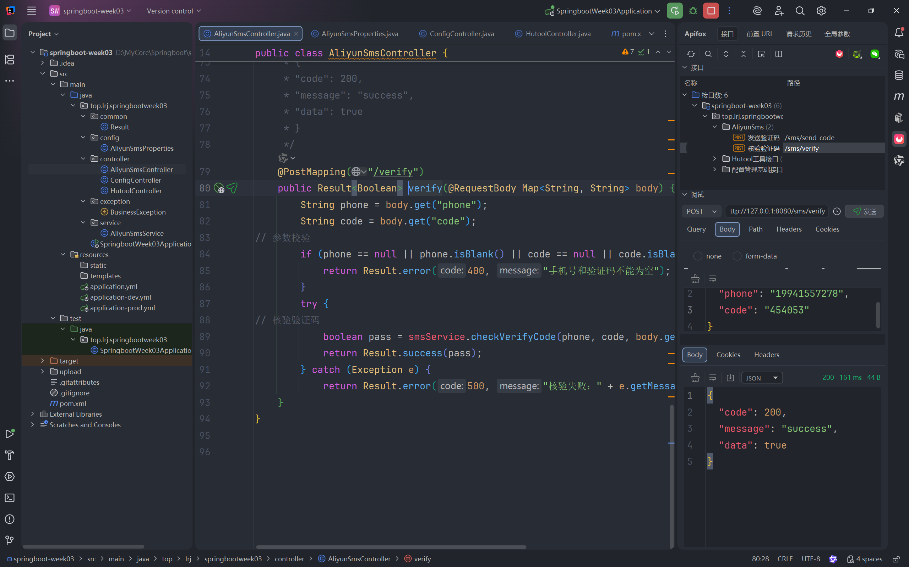

# 第 03 周大作业测试报告

## 1. 配置管理
- [ ] 1.1 AppConfig 配置类

  - [ ] 
  - ```java
    package top.lrj.springbootweek03.config;
    
    import jakarta.validation.constraints.NotBlank;
    import lombok.Data;
    import org.springframework.boot.context.properties.ConfigurationProperties;
    import org.springframework.stereotype.Component;
    import org.springframework.validation.annotation.Validated;
    /**
     * @author 李如锦
     */
    @Data
    @Component
    @ConfigurationProperties(prefix = "aliyun.sms")
    public class AliyunSmsProperties {
        private boolean enabled = true;
        private String endpoint = "dypnsapi.aliyuncs.com";
        private String regionId = "cn-hangzhou";
        private String accessKeyId;
        private String accessKeySecret;
        private String templateCode;
        private String schemeName = "默认⽅案";
    
        @NotBlank(message = "阿里云短信签名不能为空")
        private String signname;
    
    }
    ```

- [ ] 1.2 GET /api/config/app-info 截图

  - [ ] 

- [ ] 1.3 端口读取 截图

  - [ ] 


## 2. 多环境
- [ ] 2.1 dev 环境 db-info 截图
  - [ ] 

- [ ] 2.2 prod 环境 db-info 截图
  - [ ] 


## 3. 配置校验
- [ ] 3.1 校验失败启动报错截图
  - [ ] 


## 4. Hutool
- [ ] 4.1 IdUtil 接口截图
  - [ ] 

- [ ] 4.2 MD5 接口截图（text=12345）
  - [ ] 

- [ ] 4.3 文件上传接口截图
  - [ ] 


## 5. 综合接口
- [ ] 5.1 第三方服务接口截图
  - [ ] 
  - [ ] 

